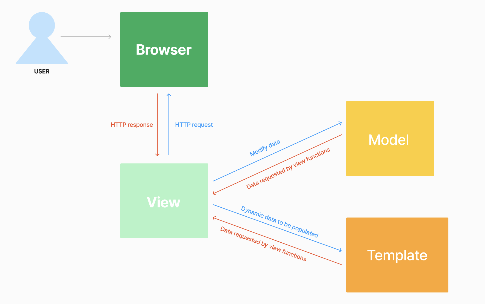

Malika Atha Indurasmi <br />
2306275203 <br />
PBP A <br />
#### Link to PWS Deployment: http://malika-atha31-quirknook.pbp.cs.ui.ac.id/ 
#### Link to Repository: https://github.com/malikaatha/quirknook-pbp 


## Tugas Individu

<details>
  <summary><b>Tugas 2: Implementasi Model-View-Template (MVT) pada Django</b></summary>

## Cara pengimplementasian checklist secara step-by-step

### 1. Membuat proyek Django
- Setelah menginisiasi git pada direktori utama yang berjudul **quirknook**, saya menghubungkan direktori tersebut dengan repository github yang berjudul **quirknook-pbp**. Setelah itu, untuk menginstal Django, saya mengaktifkan virtual environment dengan mengetik command `python -m venv env`, lalu `env\Scripts\activate`. Virtual environment berfungsi untuk menginstall package yang diperlukan hanya pada direktori tertentu tanpa memengaruhi direktori lain agar tidak terjadi conflict. <br /> <br />
- Di dalam direktori yang sama, saya membuat berkas berjudul **requirements.txt**, yaitu dokumen yang berisi dependencies yang dibutuhkan untuk diinstal pada direktori tersebut. Untuk membaca dan menginstall dependencies pada berkas tersebut, saya menjalankan perintah `pip install -r requirements.txt`. Setelah terinstal, maka saya menuliskan perintah `django-admin startproject quirknook` untuk membuat proyek django baru yang berjudul quirknook. Jika proyek django telah dibuat, maka file yang muncul di direktori tersebut di antara lain adalah **manage.py, __init__.py, asgi.py, settings.py, urls.py, wsgi.py** <br /> <br />
- Jika proyek sudah berhasil dibuat, yang selanjutnya saya lakukan adalah menlakukan konfigurasi agar proyek tersebut berjalan dengan sesuai. Untuk deployment, kita perlu menambahkan akses untuk host lokal, yaitu menambahkan `ALLOWED_HOSTS = ["localhost", "127.0.0.1"]` pada file **settings.py**.<br /> <br />
- Untuk menjalankan server Django, saya me-run perintah `python manage.py runserver`, lalu membuka local host (http://localhost:8000/). Jika sudah muncul animasi roket, maka proyek Django telah berhasil dibuat dan saya dapat menonaktifkan server Django dan juga virtual environment. <br /> <br />

### 2. Membuat aplikasi main
- Untuk membuat sebuah Django app, maka kita dapat menjalankan perintah `python manage.py startapp main`. Artinya, kita akan membuat sebuah direktori baru yang berjudul main dengan struktur berupa file-file untuk pembuatan aplikasi Django yang dibuat. <br /> <br />

### 3. Routing pada proyek untuk aplikasi main
- Untuk menambahkan aplikasi yang telah kita buat ke penggunaan Django, kita harus menambahkan nama aplikasi ke dalam konfigurasi di **settings.py** sebagai berikut: `INSTALLED_APPS = [...,'main']`<br /> <br />

### 4. Membuat model pada aplikasi dengan atribut name, price, description
- Model berisi data yang akan diproses oleh aplikasi kita. Data yang diperlukan yaitu berupa beberapa atribut seperti nama produk, harga, dan juga deskripsi produk. <br /> <br />
- Atribut-atribut dapat didefinisikan di dalam sebuah class. Class yang saya buat berjudul Product, yang nantinya akan memiliki attributes berupa nama produk, harga, dan juga deskripsi produk. <br /> <br />
- Atribut diimplementasikan dengan suatu variabel yang terikat dengan suatu data type tertentu. Contohnya adalah untuk nama produk menggunakan CharField, harga produk menggunakan IntegerField, serta deskripsi produk menggunakan TextField. <br /> <br />
- Pengimplementasian variabel tersebut dalam kode contohnya adalah sebagai berikut untuk deskripsi produk: `description = models.TextField()` <br /> <br />
- Jika saya telah selesai membuat/mengubah model, maka hal yang harus dilakukan adalah migrasi model. Migrasi model adalah cara Django melacak perubahan pada model basis data. Migrasi model dilakukan dengan command berikut: `python manage.py makemigrations` lalu `python manage.py migrate`<br /> <br />

### 5. Membuat fungsi pada views.py untuk dikembalikan ke template
- Buat fungsi show_main yang menerima parameter request untuk mengatur penerimaan http dan menampilkan tampilan yang sesuai. <br /> <br />
- Didalam fungsi show_main, terdapat dictionary _***context***_ yang berisi key berupa nama dari variabel data-data yang ingin ditampilkan pada template. Value dari key tersebut merupakan data yang nantinya akan ditampilkan pada template. <br /> <br />
- Terdapat tiga argumen return render, yaitu *request, "main.html", dan context*, yaitu request merupakan permintaan HTTP yang dikirim, *main.html* berupa berkas template untuk merender tampilan, dan *context* merupakan dictionary yang berisi data untuk ditampilkan secara dinamis. <br /> <br />

### 6. Routing pada urls.py untuk memetakan fungsi pada views.py
- Buat **urls.py** di direktori aplikasi `main` dan atur rute URL menggunakan `path('', show_main, name='show_main')` untuk menampilkan tampilan `show_main` saat URL diakses. <br /> <br />

- Tambahkan rute URL di **urls.py** proyek utama dengan `path('', include('main.urls'))` untuk menghubungkan rute URL aplikasi `main` dengan proyek secara keseluruhan, sehingga aplikasi dapat diakses melalui `http://localhost:8000/`. <br /> <br />

### 7. Deployment ke PWS
- Saya membuat proyek baru di PWS dengan nama *quirknook*. Lalu, saya juga menambahkan url dari proyek tersebut ke *settings.py* sama seperti konfigurasi untuk local host, yaitu: `ALLOWED_HOSTS = ["localhost", "127.0.0.1", "malika-atha31-quirknook.pbp.cs.ui.ac.id"]`. <br /> <br />
- Untuk setiap perubahan yang dilakukan, jika hendak mendeploy ke PWS, maka yang dilakukan untuk menge-push perubahan tersebut ke deployment adalah dengan menjalankan command berikut: `git push pws main:master`. <br /> <br />


## Bagan Request Client Django


## Fungsi git dalam pengembangan perangkat lunak!
Git memungkinkan pengembang perangkat lunak untuk melacak setiap perubahan yang dilakukan pada kode sumber proyek secara detail, termasuk siapa yang membuat perubahan maupun kapan perubahan itu dilakukan. Dengan Git, pengembang dapat dengan mudah kembali ke versi sebelumnya jika terjadi kesalahan, menggabungkan perubahan dari beberapa pengembang, dan bekerja secara kolaboratif dalam tim. Selain itu, Git juga menyediakan fitur-fitur seperti _branching_, _merging_, dan _pull request_ yang sangat berguna untuk mengelola proyek yang kompleks.

## Mengapa framework Django dijadikan permulaan pembelajaran pengembangan perangkat lunak?
Django sering digunakan sebagai permulaan dalam pembelajaran pengembangan perangkat lunak karena mengadopsi arsitektur Model-Template-View (MTV) yang memisahkan logika bisnis, presentasi, dan data, sehingga memudahkan pemahaman konsep dasar pengembangan web. Arsitektur ini membantu pemula memahami bagaimana komponen-komponen aplikasi berinteraksi. Selain itu, Django menyediakan banyak alat bawaan (template) yang memungkinkan pemula yang sedang belajar untuk fokus pada pembelajaran struktur dan alur kerja pengembangan tanpa harus membuat semuanya dari awal.

## Mengapa model pada Django disebut sebagai ORM?
Model pada Django disebut ORM (Object-Relational Mapper) karena ORM merupakan fitur yang memungkinkan developer untuk berinteraksi dengan database secara intuitif menggunakan sintaks Python. Dengan ORM, user dapat memetakan struktur database ke dalam objek Python, sehingga user tidak perlu menulis query SQL secara langsung. Django akan secara otomatis menerjemahkan operasi pada objek Python ini menjadi query SQL yang sesuai. Hal ini membuat pengelolaan data menjadi lebih mudah dan efisien, sehingga Anda dapat fokus pada pengembangan fitur-fitur inti aplikasi Anda.

</details>
<details>
  <summary><b>Tugas 3: Implementasi Form dan Data Delivery pada Django</b></summary>

## Data delivery dalam pengimplementasian sebuah platform?
Dalam mengimplementasikan platform, data delivery diperlukan untuk memastikan pertukaran informasi antara berbagai komponen sistem/sistem yang berbeda dapat berjalan secara efisien.Dengan menggunakan format seperti HTML, XML, atau JSON, data delivery memungkinkan data diproses dengan cara yang sesuai dengan kebutuhan spesifik aplikasi secara tampilan maupun penyimpanan data.

## Lebih baik XML atau JSON? Mengapa JSON lebih populer?
Menurut saya, JSON merupakan markup language yang lebih baik daripada XML. Alasan JSON lebih baik daripada XML dan juga merupakan format yang lebih populer adlah karena struktur data JSON yang sederhana dengan menggunakan key-value yang membuatnya lebih efisien dibandingkan XML yang menggunakan tag-tag yang lebih kompleks. Selain itu, JSON cenderung lebih efisien data karena tidak memiliki overhead tag. Karena kepopuleran ini, JSON lebih umum digunakan oleh developer sehingga developer lain juga menggunakan JSON.

##  Fungsi dari `is_valid()` pada form Django?
Method `is_valid()` pada form Django berfungsi untuk memvalidasi data yang dikirimkan. Method tersebut memastikan bahwa data tersebut memenuhi semua kriteria validasi yang telah ditetapkan dalam form. Jika semua data valid, nilai yang dikembalikan adalah `True` dan jika ada kesalahan, nilai yang dikembalikan adalah `False`. Method ini memungkinkan developer untuk menangani dan menampilkan pesan kesalahan dengan tepat. Penggunaan `is_valid()` penting untuk menjaga keamanan dan konsistensi data serta memisahkan logika validasi dari pemrosesan data lebih lanjut.

## csrf_token
csrf_token diperlukan di Django untuk melindungi aplikasi web dari serangan Cross-Site Request Forgery (CSRF). Tanpa csrf_token, aplikasi menjadi rentan terhadap serangan di mana penyerang dapat memanfaatkan kredensial user yang sudah login untuk mengirimkan permintaan berbahaya secara tidak sah. Token ini bekerja dengan memastikan bahwa setiap permintaan POST yang diterima berasal dari sumber yang sah dan bukan dari pihak ketiga yang mencoba mengeksploitasi aplikasi. Dengan menyertakan csrf_token dalam form, Django dapat memverifikasi bahwa permintaan tersebut benar-benar berasal dari aplikasi/web yang sama. Hal ini dapat mengurangi risiko tindakan tidak sah serta meningkatkan keamanan aplikasi.

## Cara pengimplementasian checklist secara step-by-step
### 1. Menambahkan Input Form untuk Menambahkan Objek Model
- Untuk memungkinkan penambahan objek model ke dalam aplikasi, saya membuat formulir input menggunakan `ModelForm`. Form ini akan memungkinkan user untuk memasukkan data untuk model productEntry. Buat berkas `forms.py` di aplikasi Django dan mendefinisikan form dengan atribut yang diperlukan seperti `name`, `price`, dan `description`.<br /> <br />
- Saya menambahkan fungsi view baru untuk menampilkan formulir ini dan menangani data yang di-submit. Formulir akan ditampilkan pada halaman HTML baru yang saya buat di direktori templates.<br /> <br />

### 2. Menambahkan Empat Fungsi Views untuk Melihat Objek dalam Format XML dan JSON
- Saya menambahkan dua fungsi view baru. Satu fungsi untuk mengembalikan data objek model Product dalam format JSON dan satu lagi dalam format XML. Fungsi ini akan meng-serialize data objek dan mengirimkannya dalam format yang sesuai.<br /> <br />
- Saya juga menambahkan dua fungsi view untuk menampilkan objek berdasarkan ID dalam format JSON dan XML. Fungsi ini berfungsi untuk mencari objek dengan ID tertentu dan mengembalikannya dalam format yang sesuai.<br /> <br />

### 3. Menambahkan Routing URL untuk Masing-Masing Views
- Untuk mengakses fungsi-fungsi view yang telah ditambahkan, saya membuat routing URL baru. Routing ini akan mengarahkan permintaan ke fungsi view yang sesuai berdasarkan path URL. Selain itu, berkas `urls.py` dimodifikasi dengan menambahkan URL baru untuk form input, serta URL untuk melihat data dalam format JSON dan XML baik untuk semua objek maupun berdasarkan ID.

</details>
<details>
  <summary><b>Tugas 4: Implementasi Autentikasi, Session, dan Cookies pada Django</b></summary>

## Apa perbedaan antara HttpResponseRedirect() dan redirect()?
- `HttpResponseRedirect()` : Respons HTTP dengan cara secara eksplisit memberikan sebuah url sebagai parameternya. Nantinya, user akan diarahkan ke URL tersebut.
- `redirect()` : Respons HTTP yang dapat didefinisikan dengan URL pattern pada urls.py. Response dapat berubah secara dinamis mengikuti pola URL jika sewaktu0waktu diubah.

## Jelaskan cara kerja penghubungan model Product dengan User
Di Django, model Product biasanya dihubungkan dengan model User menggunakan ForeignKey. Pada model Product, tambahkan field user yang memiliki tipe **ForeignKey** yang mengacu pada model User. Hal ini memungkinkan setiap produk untuk dihubungkan dengan user yang membuatnya. Selain itu, ForeignKey dapat diatur dengan opsi on_delete (misalnya CASCADE), yang menentukan aksi lanjutan jika user dihapus. Dengan hubungan ini, kita dapat mengakses data user melalui produk ataupun sebaliknya.

## Apa perbedaan antara authentication dan authorization, apakah yang dilakukan saat pengguna login? Jelaskan bagaimana Django mengimplementasikan kedua konsep tersebut.
- Authentication adalah proses yang dilakukan untuk memverifikasi identitas user untuk memastikan kebenaran data user yang diklaim. Di proses ini, kebenaran kredensial user seperti password atau username dicek.
- Authorization adalah proses untuk menentukan hak akses user setelah user sudah berhasil melalui proses authentication. Hal ini dilakukan supaya user dengan role tertentu memiliki izin untuk mengakses data atau melakukan tindakan tertentu.

Django mengimplementasikan authentication melalui model User dan sistem auth untuk memverifikasi identitas pengguna, sedangkan authorization dikelola dengan permissions dan decorators seperti @login_required untuk mengontrol hak akses pengguna.

## Bagaimana Django mengingat pengguna yang telah login? Jelaskan kegunaan lain dari cookies dan apakah semua cookies aman digunakan?
Django menyimpan status login user menggunakan session cookies. Saat pengguna login, Django menyimpan informasi pengguna dalam cookie yang terhubung dengan session tersebut. Pengguna akan tetap terautentikasi selama sesi berlangsung, tanpa harus login ulang di setiap halaman baru. Selain autentikasi, cookies juga bisa digunakan untuk menyimpan preferensi atau data sementara pengguna. Namun, cookies yang tidak dilindungi dengan baik rentan terhadap serangan seperti cookie hijacking. Untuk keamanan, Django menggunakan session cookies yang aman, misalnya dengan mengaktifkan HttpOnly dan Secure flags.

#### 1. Implementasi registrasi, login, dan logout
Saya memulai dengan membuat halaman registrasi, mengimpor **UserCreationForm** dan **messages** di `views.py`, kemudian membuat fungsi `register` untuk memproses pembuatan akun baru dan menampilkan form registrasi di `register.html`. Lalu, saya menambahkan fungsi `login_user` yang menggunakan **AuthenticationForm** untuk otentikasi pengguna dan menampilkan form login di `login.html`. Setelah berhasil login, pengguna diarahkan ke halaman utama. Fungsi `logout_user` saya tambahkan untuk menghapus sesi pengguna, serta menambahkan tombol logout di halaman utama (`main.html`). Semua fungsi ini dihubungkan melalui `urls.py`.

### 2. Membuat dua akun pengguna dengan tiga dummy data masing-masing 
Pertama, saya mendaftarkan dua akun pengguna melalui halaman registrasi dengan mengisi username dan password. Setelah login, saya menambahkan tiga produk untuk setiap akun melalui form yang berisi nama produk, harga, dan deskripsi. Proses ini saya ulangi untuk akun kedua dengan cara yang sama.

### 3. Menghubungkan model Product dengan User
Saya menambahkan relasi **ForeignKey** antara model **Product** dan **User** di `models.py`. Di `views.py`, saya memodifikasi fungsi `create_product` agar produk yang ditambahkan terhubung dengan pengguna yang sedang login, dan hanya menampilkan produk milik pengguna tersebut di halaman utama (`show_main`) menggunakan filter `user=request.user`. Setelah itu, saya menjalankan perintah `python3 manage.py makemigrations` dan melakukan migrasi. Saya juga mengatur `DEBUG` untuk mode produksi di `settings.py` dan menjalankan server.

### 4. Menampilkan detail pengguna yang login dan menggunakan cookies
Saya menambahkan cookie untuk menyimpan data `last_login` dan menampilkannya di halaman utama. Di fungsi `login_user`, setelah login berhasil, saya menggunakan `response.set_cookie()` untuk menyimpan `last_login`. Di `show_main`, data `last_login` dari cookie ditampilkan dalam `context`. Pada `logout_user`, saya menghapus cookie `last_login` menggunakan `response.delete_cookie()`. Di `main.html`, saya menambahkan kode untuk menampilkan `last_login` di halaman utama, lalu memeriksa hasilnya melalui browser untuk memastikan cookie disimpan dengan benar.


</details>
<details>
  <summary><b>Tugas 5: Desain Web menggunakan HTML, CSS dan Framework CSS</b></summary>

## Jika terdapat beberapa CSS selector untuk suatu elemen HTML, jelaskan urutan prioritas pengambilan CSS selector tersebut!
CSS Selectors berfungsi untuk memilih elemen HTML yang akan berlaku dalam Style CSS tersebut. Terdapat 3 selector yaitu Element Selector (tanpa # atau .), Class selector (diawali .), dan ID Selector (diawali #). 

Jika terdapat dua atau lebih aturan yang dipakai dalam satu elemen, selecot dengan specificity tertinggi lah yang akan diterapkan ke elemen tersebut. Berikut merupakan kategori dalam penentuan specificity CSS selector

### Specificity Order:
1. **Inline Styles** (Specificity: 1000) - Contoh: `<h1 style="color: pink;">`
2. **ID Selector** (Specificity: 0100) - Contoh: `#navbar`
3. **Class Selector**, **Pseudo-class**, **Attribute Selector** (Specificity: 0010) - Contoh: `.class, :hover, [href]`
4. **Element Selector**, **Pseudo-element** (Specificity: 0001) - Contoh: `h1, ::before`

### Cascading Principles:
1. **Source**: Gaya dari inline > stylesheet eksternal > browser default.
2. **Specificity**: Selector dengan specificity tertinggi yang diambil.
3. **Order**: Jika specificity sama, gaya yang ditulis terakhir akan diambil.

### `!important`
Mengabaikan specificity dan urutan jika digunakan, tetapi harus digunakan dengan bijak.

##  Mengapa responsive design menjadi konsep yang penting dalam pengembangan aplikasi web? Berikan contoh aplikasi yang sudah dan belum menerapkan responsive design!
Dalam mengembangkan web atau aplikasi, responsive design merupakan hal yang penting untuk diterapkan untuk mengoptimalkan User Experience. Dengan responsive design, maka saat pengguna menggunakan aplikasi dan memiliki kepentingan untuk me-resize halaman yang dibuka, tidak ada kekacauan dari design yang seharusnya. Elemen-elemen halaman akan menyesuaikan ukurannya secara dinamis sesuai dengan menyesuaikan resolusi perangkat yang digunakan sehingga layout akan ditampilkan secara rapi.

Dari sisi developer, dengan mengembangkan responsive design maka tidak perlu dilakukan pengembangan dan penyesuaian yang terpisah untuk tiap perangkat yang berbeda. Hal ini tentunya meningkatkan efisiensi dalam pengembangan, menghemat waktu, dan menghemat sumber daya lain.

### Aplikasi yang sudah menerapkan responsive design
- Twitter
- SCELE
- Visual Studio Code

### Aplikasi yang belum menerapkan responsive design
- BCA Mobile
- Photomath

## Jelaskan perbedaan antara margin, border, dan padding, serta cara untuk mengimplementasikan ketiga hal tersebut!
## Perbedaan antara Margin, Border, dan Padding

### 1. **Margin**
- **Margin** adalah ruang di luar elemen HTML, digunakan untuk mengontrol jarak antara elemen dan elemen lainnya.
- Dapat diatur menggunakan properti seperti `margin-top`, `margin-right`, `margin-bottom`, dan `margin-left`.
- Contoh:
    ```
    margin-top: 5px;
    margin-right: 10px;
    margin-bottom: 15px;
    margin-left: 20px; 
    ```

  ### 2. **Padding**
- Padding adalah ruang di dalam elemen HTML, antara konten elemen dan batas (border) elemen tersebut.
- Dapat diatur menggunakan properti seperti `padding-top`, `padding-right`, `padding-bottom`, dan `padding-left`.
- Contoh:
    ```
    padding-top: 5px;
    padding-right: 10px;
    padding-bottom: 15px;
    padding-left: 20px; 
    ```

### 3. **Border**
- Border adalah garis yang mengelilingi elemen HTML, antara margin dan padding.
- Bisa diatur menggunakan shorthand border, atau properti terpisah seperti border-width, border-style, dan border-color.
- Contoh: `border: 2px solid black;`


##  Jelaskan konsep flex box dan grid layout beserta kegunaannya!
- Flexbox (Flexible Box Layout) 
Adalah model layout satu dimensi yang dirancang untuk mengatur elemen dalam satu baris atau kolom.
Fungsi:
    - Membuat layout yang fleksibel dan responsif
    - Menyusun elemen secara horizontal atau vertikal
    - Mengatur spacing dan alignment antar elemen dengan mudah
    - Membuat navigasi, header, footer, atau sidebar
    - Cocok untuk digunakan pada komponen satu dimensi (baris atau kolom)

- Grid Layout adalah sistem layout dua dimensi yang memungkinkan Anda mengatur elemen dalam baris dan kolom sekaligus.
Fungsi:
    - Membuat layout kompleks dengan mudah
    - Mengatur elemen dalam grid terstruktur
    - Membuat desain responsif yang konsisten
    - Cocok untuk layout halaman utuh, galeri, atau dashboard
    - Cocok untuk digunakan pada komponen satu dimensi (baris dan kolom)

## Implementasi Checklist

### Langkah 1: Implementasi Fungsi untuk Menghapus dan Mengedit Produk

1. **Membuat View untuk Mengedit dan Menghapus**:
   - **Edit Produk**:
    Saya menambahkan view untuk mengedit produk di `views.py` dengan kode sebagai berikut:
     ```python
     from django.shortcuts import render, get_object_or_404, redirect
     from .models import Product
     from .forms import ProductForm

     def edit_product(request, product_id):
         product = get_object_or_404(Product, id=product_id)
         if request.method == 'POST':
             form = ProductForm(request.POST, instance=product)
             if form.is_valid():
                 form.save()
                 return redirect('main:product_list')  # Ganti dengan nama URL yang sesuai
         else:
             form = ProductForm(instance=product)
         return render(request, 'edit_product.html', {'form': form})
     ```

   - **Hapus Produk**:
    Menambahkan view untuk menghapus produk:
     ```python
     def delete_product(request, product_id):
         product = get_object_or_404(Product, id=product_id)
         product.delete()
         return redirect('main:product_list')  # Ganti dengan nama URL yang sesuai
     ```

2. **Menambahkan Form untuk Produk**:
    Selanjutnya, saya membuat form di `forms.py` dengan kode sebagai berikut:
     ```python
     from django import forms
     from .models import Product

     class ProductForm(forms.ModelForm):
         class Meta:
             model = Product
             fields = ['name', 'description', 'price']
     ```

3. Menambahkan URL untuk Edit dan Hapus**:
   - Menghubungkan Views maupun Form yang telah dibuat dengan memodifikasi `urls.py` untuk mendapatkan rute url:
     ```python
     from django.urls import path
     from . import views

     urlpatterns = [
         path('edit/<int:product_id>/', views.edit_product, name='edit_product'),
         path('delete/<int:product_id>/', views.delete_product, name='delete_product'),
     ]
     ```

### Langkah 2: Kustomisasi Desain pada Template HTML

1. **Menggunakan CSS Framework**:
   Saya memilih untuk menggunakan framework CSS, yaitu Tailwind CSS, dan menggunakannya di proyek. Kita perlu menambahkannya di `base.html` sebagai link referensi:
   ```html
   <link href="https://cdn.jsdelivr.net/npm/tailwindcss@2.0.0/dist/tailwind.min.css" rel="stylesheet">
   ```

2. **Kustomisasi Halaman Login dan Register**:
   Setelah itu mengedit file `login.html` dan `register.html` untuk menambahkan kelas Tailwind agar tampil lebih menarik:
   ```html
   <form method="POST" class="max-w-md mx-auto bg-white p-8 rounded shadow-md">
       
       <!-- Tambahkan input username dan password -->
       <button type="submit" class="w-full bg-blue-500 hover:bg-blue-600 text-white font-bold py-2 px-4 rounded">
           Login
       </button>
   </form>
   ```

3. **Kustomisasi Halaman Tambah Produk dan Daftar Produk**:
   Saya menyesuaikan form untuk tambah produk agar lebih menarik dengan Tailwind CSS. Kustomisasi Halaman Daftar Produk dengan penambahan template `product_list.html` untuk setiap produk.

5. **Menangani Kondisi Jika Tidak Ada Produk**:
   Saya menambahkan kondisi di `product_list.html` untuk menampilkan gambar dan pesan jika tidak ada produk:
   ```html
   
       <div class="flex flex-col items-center">
           
           <p class="text-gray-600">Belum ada produk yang terdaftar.</p>
       </div>
   
   ```

### Langkah 3: Membuat Navbar Responsif

1. **Membuat Navbar dengan Tailwind CSS**:
   - Saya membuat navbar di `navbar.html` menggunakan kelas responsif:
   ```html
   <nav class="bg-gradient-to-r from-blue-700 via-blue-600 to-blue-300 p-4">
       <div class="max-w-7xl mx-auto flex justify-between items-center">
           <div class="flex items-center">
               
               <h1 class="text-2xl font-bold text-white">QuirkNook</h1>
           </div>
           <div class="hidden md:flex space-x-4">
               <a href="" class="bg-yellow-500 text-white py-2 px-4 rounded">Home</a>
               <a href="" class="bg-yellow-500 text-white py-2 px-4 rounded">User Info</a>
           </div>
           <div class="md:hidden flex items-center">
               <button class="mobile-menu-button">
                   <svg class="w-6 h-6 text-yellow-400" fill="none" viewBox="0 0 24 24">
                       <path d="M4 6h16M4 12h16M4 18h16" stroke="currentColor" stroke-width="2"></path>
                   </svg>
               </button>
           </div>
       </div>

       <div class="mobile-menu hidden">
           <a href="" class="block text-center bg-yellow-500 text-white py-2">Home</a>
           <a href="" class="block text-center bg-yellow-500 text-white py-2">User Info</a>
       </div>
   </nav>
   ```

2. **Menambahkan Responsivitas untuk Mobile**:
   - Saya menggunakan JavaScript untuk mengatur tampilan menu mobile saat tombol diklik:
   ```javascript
   const btn = document.querySelector("button.mobile-menu-button");
   const menu = document.querySelector(".mobile-menu");

   btn.addEventListener("click", () => {
       menu.classList.toggle("hidden");
   });
   ```

### Langkah 4: Testing dan Review

1. **Menjalankan Server**:
   Untuk melakukan pengujian, saya menjalankan server pengembangan Django dan mengakses aplikasi untuk memastikan semua fungsi berjalan dengan baik:
   ```bash
   python manage.py runserver
   ```

2. **Testing Fungsionalitas Program**:
   - Saya menguji semua fitur seperti login, register, tambah produk, edit, dan hapus produk untuk memastikan semuanya berfungsi dengan baik.

3. **Review Desain**:
   - Saya memeriksa tampilan pada berbagai ukuran layar untuk memastikan responsivitas, terutama untuk navbar dan card produk.

</details>

<details>
  <summary><b>Tugas 6: JavaScript dan AJAX</b></summary>

## Jelaskan manfaat dari penggunaan JavaScript dalam pengembangan aplikasi web!
Javascript digunakan dalm pengembangan web karena menyediakan aksses bagi developer intuk membuat situs yang interaktif. Contohnya adalah fitur seperti form validation, refresh konten secara dinamis, animasi, dan feedback pengguna seperti pop-up, warning, dll. Selain itu, dengan library JS lain seperti React, Angular, dan Vue.js, developer dapat membangun interface yang lebih repsonsif dengan lebih mudah karena adanya framework yang disediakan.

Selain itu, terdapat AJAX (Asynchronous JavaScript and XML) dan Fetch API, yang memungkinkan pengambilan data secara asinkronus. Dengan AJAX, aplikasi web dapat meminta data dari server di tanpa mengganggu interaksi pengguna dengan halaman. 

## Jelaskan fungsi dari penggunaan await ketika kita menggunakan fetch()! Apa yang akan terjadi jika kita tidak menggunakan await?
Fungsi dari await adalah kata kunci khusus yang digunakan dalam fungsi asinkron (async) untuk "menunggu" hingga sebuah promise selesai sebelum melanjutkan eksekusi kode berikutnya. Saat kita menggunakan await dengan fetch(), kita memastikan bahwa operasi pengambilan data selesai dan respons telah diterima sebelum kode berikutnya dijalankan.

Fungsi await ini akan menunda eksekusi kode berikutnya hingga promise dari fetch() selesai. Jika await tidak digunakan dalam fetch(), maka fungsi asinkron akan berjalan secara synchronous, yaitu langsung mengembalikan promise tanpa menunggu hasilnya. 

## Mengapa kita perlu menggunakan decorator csrf_exempt pada view yang akan digunakan untuk AJAX POST?
Penggunaan `@csrf_exempt` pada view yang digunakan untuk AJAX POST dalam framework Django diperlukan untuk menonaktifkan pemeriksaan CSRF (Cross-Site Request Forgery) pada permintaan tersebut. CSRF adalah serangan di mana pengguna yang diautentikasi dapat secara tidak sengaja mengirimkan permintaan berbahaya ke server. Django memiliki mekanisme perlindungan CSRF yang memerlukan token khusus dalam setiap permintaan POST, PUT, atau DELETE untuk memastikan keabsahan sumbernya. 

Meskipun menyertakan token CSRF dalam permintaan AJAX sangat dianjurkan, ada situasi di mana hal ini mungkin sulit atau tidak diperlukan, seperti pada API endpoint publik yang tidak sensitif terhadap serangan CSRF. Dalam kasus tersebut, penggunaan `@csrf_exempt` memungkinkan permintaan AJAX POST dilakukan tanpa perlu menyertakan token CSRF, meskipun penggunaannya harus dilakukan dengan hati-hati karena dapat membuka celah keamanan. Sebaiknya, jika memungkinkan, menyertakan CSRF token dalam permintaan AJAX lebih baik daripada menonaktifkan perlindungan CSRF.

##  Pada tutorial PBP minggu ini, pembersihan data input pengguna dilakukan di belakang (backend) juga. Mengapa hal tersebut tidak dilakukan di frontend saja?
- Dari segi keamanan, jika hanya menerapkan pembersihan di frontend, maka web akan dengan mudah dimanipulasi oleh pengguna. Hacker akan dengan mudah melewatkan validasi dengan mengirim permintaan langsung ke server.
- Dengan mengimplementasikan pembersihan data ke backend, maka kita dapat menjamin bahwa semua data yang masuk ke sistem sudah dibersihkan, terlepas dari sumber datanya.
- Terdapat kemungkinan adanya validasi yang lebih kompleks dan menjamin yang hanya dapat terimplementasikan di backend.
- Memindahkan sebagian validasi ke server dapat mengurangi beban pada perangkat klien, terutama untuk perangkat dengan sumber daya terbatas.

## Implementasi checklist
### Membuat Fungsi untuk menambahkan Product dengan AJAX
1. Menambahkan `import csrf_exempt` dan `import require_POST`
2. Membuat fungsi `add_product_ajax` yang nantinya akan digunakan untuk menambah produk baru dengan menggunakan AJAX.

### Menambahkan Routing Untuk Fungsi `add_product_ajax`
1. Mengimpor fungsi `add_product_ajax` yang telah dibuat pada checklist sebelumnya.
2. Menambahkan path baru dalam list urlpatterns:
    `[..., path('create--entry-ajax', , name=''),...]`

### Menampilkan Data Product dengan fetch() API
1. Untuk tutorial ini, kita akan mengam bil data product dari endpoint /json sehingga kita tidak memerlukan lagi product_entries.
2. Pada berkas views.py, saya menghapus baaris pertama pada show_json dan juga product_entries pada show_main.
3. Pada berkas main.html, saya menghapus blok code yang awalnya ditujukan untuk mengiterasi products di dalam product_entries.
4. Block code pada oin 3 diganti dengan `<div id="product_cards"></div>`.
5. Menambahkan block script sebelum endblock content:
   ```<script>
    async function getProductEntries(){
    return fetch("").then((res) => res.json())
    }
    </script>
    ```
   Nantinya, fungsi ini akan menggunakan fetch() API dan parse data JSON menjadi objeck JavaScript.
6. Tambahkan fungsi `refreshProductEntires()` di dalam tag <script> sebelum menutup </body> di berkas main.html.

### Implementasi Modal untuk Menambahkan Product
1. Menambahkan Modal di bawah elemen dengan ID product_cards di berkas main/templates/main.html.
2. Membuat fungsi untuk menampilkan dan menyembunyikan modal, serta menambahkan event listener untuk tombol close dan cancel.
3. Mengubah tombol "Add New Products" dan mengganti dengan tombol baru yang akan menjalankan modal untuk menambah product dengan AJAX.

### Menambahkan Data Mood dengan AJAX
1. Fungsi untuk Mengirim Data: Buat fungsi JavaScript yang mengirim data dari form modal menggunakan AJAX ke server.
2. Event Listener: Tambahkan event listener pada form di dalam modal untuk memanggil fungsi yang telah dibuat ketika form disubmit.

